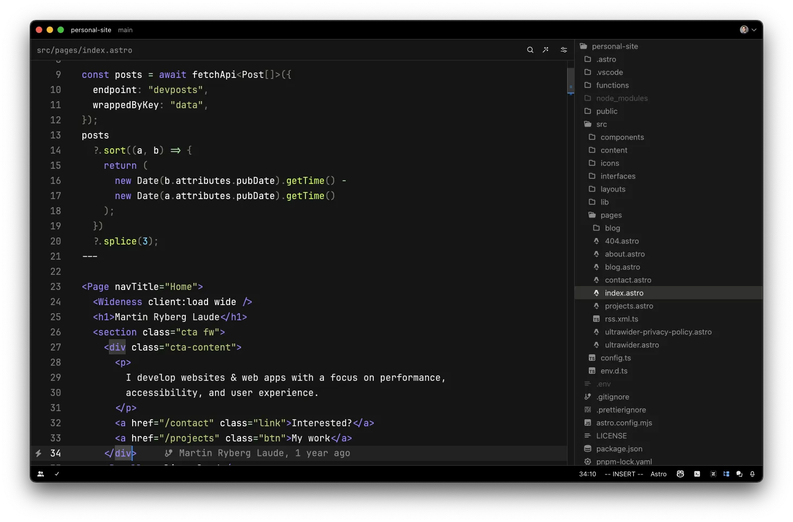

  <h1 align="center">CodeSandbox Theme for Zed</h1>
  
An unofficial CodeSandbox theme for Zed.

## Install

Install this theme from the extensions store in Zed.

Then select it in [the theme picker](https://zed.dev/docs/themes).

## Contribute
Found an issue, or have an improvement? No problem, use issues and PRs here in Github 📝
